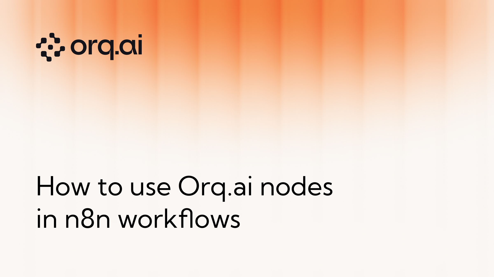
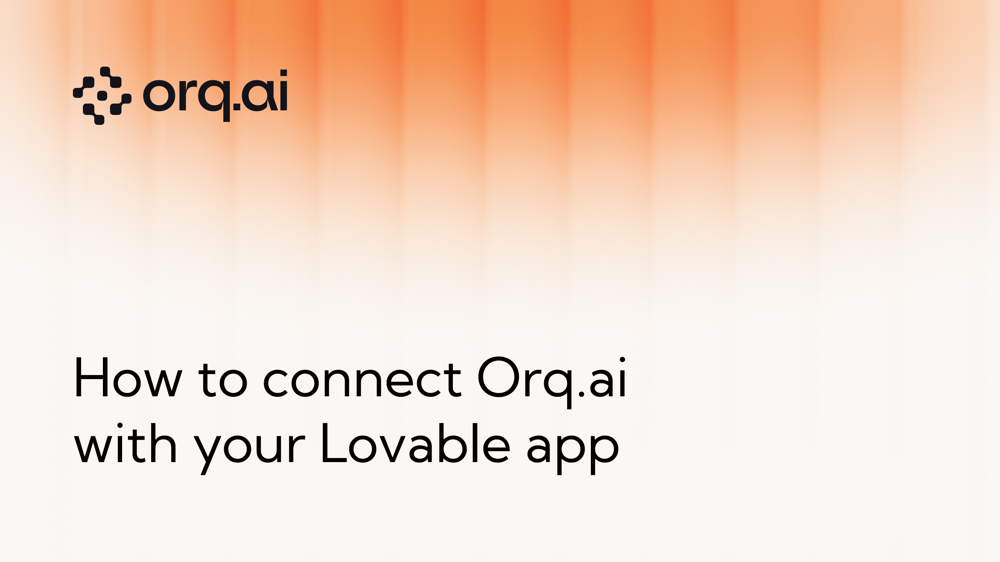

## Orq.ai Tutorials
This repository contains a collection of Jupyter notebooks and TypeScript repositories accompanying the Cookbooks in the documentation designed to demonstrate and facilitate AI-powered data extraction and processing tasks through Orq.ai. Each notebook serves a specific purpose, from extracting structured data from unstructured sources to generating SQL queries from natural language inputs.

### Getting Started & Core Concepts
| Tutorial | Description |
|----------|-------------|
|  | **[Orq.ai as Prompt Manager](https://docs.orq.ai/docs/tutorials/prompt-manager)** • Centralized prompt management • Version control • Prompt optimization tools |
|  | **[Maintaining Chat History](https://docs.orq.ai/docs/tutorials/maintaining-history-with-a-model)** • Conversation context management • Chat history persistence • Context-aware responses |
|  | **[Chaining Deployments and Running Evaluations](https://docs.orq.ai/docs/tutorials/chaining-deployments)** • Multi-deployment workflows • Financial data processing • Image file handling |
|  | **[LLM Glossary](https://docs.orq.ai/docs/tutorials/llm-glossary)** • Comprehensive terminology reference • Concept explanations • LLM best practices |

### Integrations & Workflows
| Tutorial | Description |
|----------|-------------|
|  | **[Orq.ai Nodes in n8n Workflows](https://docs.orq.ai/docs/tutorials/how-to-use-orqai-nodes-in-n8n-worklfows)** • Seamless n8n integration • Workflow automation • Node-based configuration |
|  | **[Lovable App Integration](https://docs.orq.ai/docs/tutorials/lovable-integration)** • Direct Lovable integration • Application connectivity • Configuration guides |
|  | **[Third-Party Vector Databases](https://docs.orq.ai/docs/tutorials/using-thirdparty-vectordbs-with-orq)** • Multiple vector DB support • External database integration • Flexible data storage options |

### Document & Data Processing
| Tutorial | Description |
|----------|-------------|
|  | **[Data Extraction from PDF](https://docs.orq.ai/docs/tutorials/pdf-extraction)** • Multi-template invoice support • Pre-processing for noisy or low-quality PDFs • Output formats: CSV, JSON |
|  | **[Image-Based Receipt Extraction](https://docs.orq.ai/docs/tutorials/receipt-extraction)** • Identifies merchant names, dates, and itemized costs • Handles image distortion and varying lighting • JSON output format |
|  | **[Text-to-SQL](https://docs.orq.ai/docs/tutorials/text-to-sql)** • Wide database schema support • SQL query validation mechanism • Ideal for data analysts and non-technical users |

### AI Applications & Use Cases
| Tutorial | Description |
|----------|-------------|
|  | **[Intent Classification](https://docs.orq.ai/docs/tutorials/intent-classification)** • Pre-trained language models for high accuracy • Custom intent categories • Performance evaluation with confusion matrix and metrics |
|  | **[Multilingual FAQ Bot Using RAG](https://docs.orq.ai/docs/tutorials/multilingual-faq-bot)** • Multi-language support • RAG-based retrieval • FAQ automation |

### Observability & Optimization
| Tutorial | Description |
|----------|-------------|
|  | **[Capturing and Leveraging User Feedback](https://docs.orq.ai/docs/tutorials/capturing-feedback-with-orq)** • Feedback collection mechanisms • Performance improvement tracking • Accuracy optimization tools |
